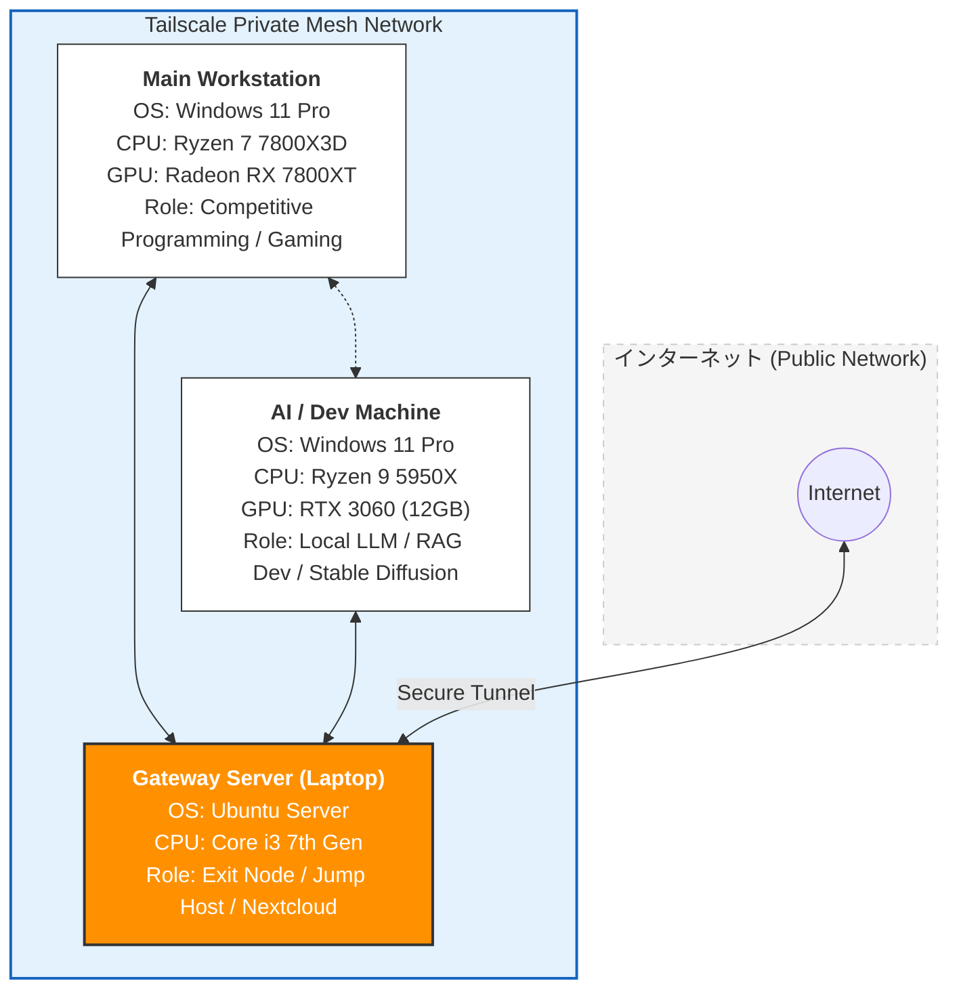

# 🚀 Home-Lab & Hybrid Remote Access Architecture
外出先や大学から、自宅の計算リソース（AI開発・競技プログラミング用マシン）へ安全かつシームレスにアクセスするためのプライベートネットワーク環境です。

## 🌐 Network Diagram

## 📋 System Design & Features
1. セキュアなリモートアクセスと出口ノード (Exit Node)
Tailscale (WireGuardベース) を採用することで、複雑なルーターのポート開放設定を排除し、大学の学内LANや公衆Wi-Fiなどの制限された環境下でも、自宅環境へのL3レベルのセキュアな接続を実現しています。

Ubuntu Server (Laptop) を出口ノードとして設定。安全性の低いネットワークを利用する際、すべての通信を自宅の暗号化されたトンネル経由（固定回線）でルーティングし、セキュリティを担保しています。

2. コンピュートリソースの最適配置
AI / Dev Machine: ローカルLLMの推論やRAG（Retrieval-Augmented Generation）の研究開発、Stable Diffusionを用いた画像生成に特化。RTX 3060 (12GB) の豊富なVRAMを活かした開発環境を構築しています。

Main Workstation: Ryzen 7 7800X3Dの高いシングルスレッド性能を活用し、競技プログラミング（AtCoder/Paiza）のコード作成や日常的な開発業務を担当。

Server (Sustainable Hardware): 旧世代のノートPCを再利用することで、消費電力を抑えつつ24時間稼働のファイルサーバー（Nextcloud）および踏み台サーバーとして運用しています。

3. 主な用途
大学からのリモート開発: 大学の講義中や研究室から、自宅のGPUリソースをVS CodeのRemote SSH経由で利用。

プライベートクラウド: Nextcloudによるデバイス間でのファイル同期およびバックアップ。

安全性確保: 出先からのインターネット利用時におけるプライバシー保護。
